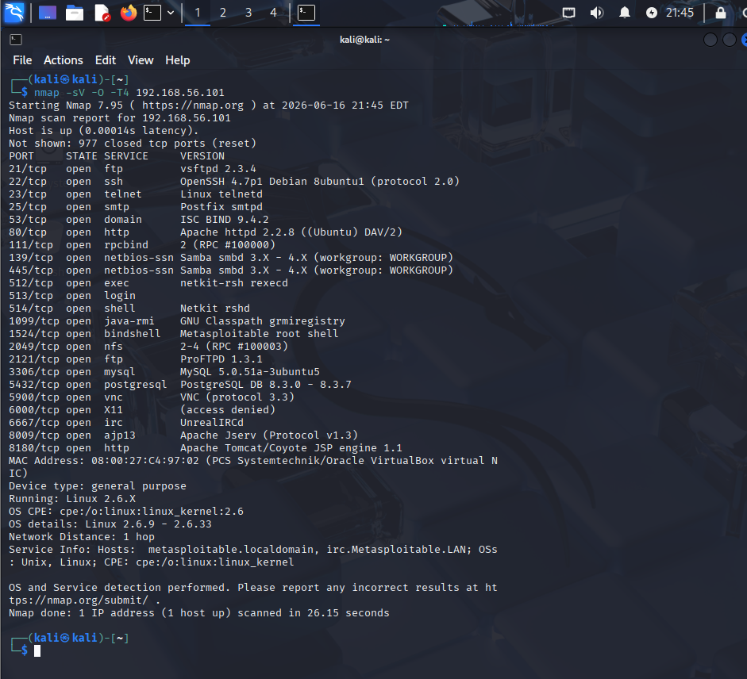
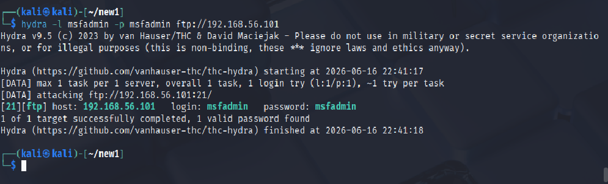
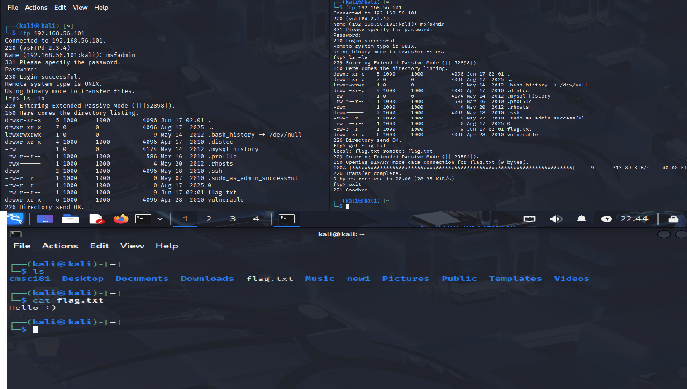
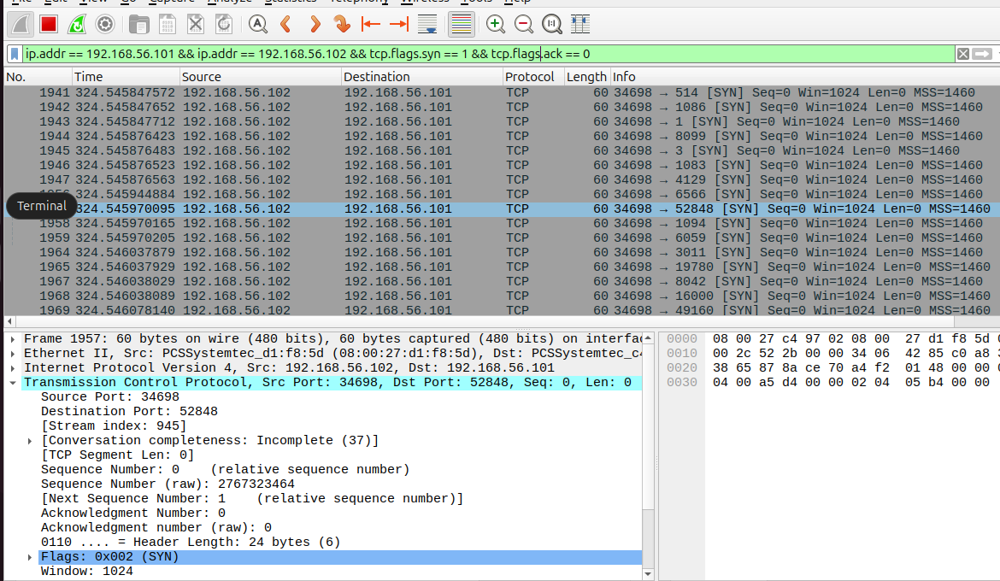
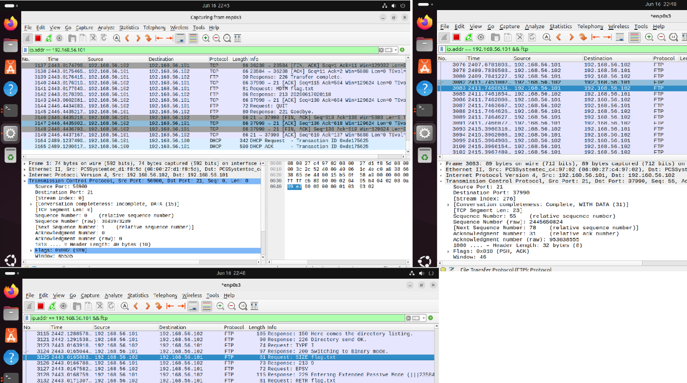

# Detection and Analysis of Simulated Adversary Activity

## Objective

Simulate attacker activity against a vulnerable Linux host and analyze the resulting traffic from a defensive perspective.

## Lab Environment

### Red Team
- Kali Linux
- IP: 192.168.56.102

### Victim
- Metasploitable 2
- IP: 192.168.56.101

### Blue Team
- Ubuntu Linux
- Wireshark
- Wazuh

## Service Enumeration

An Nmap scan was performed to identify exposed services on the target host.

The scan identified multiple exposed services including FTP, SSH, SMB, HTTP, MySQL, and PostgreSQL.

## Credential Validation

Hydra was used against the FTP service to validate credentials.

The credentials `msfadmin:msfadmin` were successfully identified.

## Initial Access and File Retrieval

FTP access was established using the validated credentials.

A file was successfully downloaded from the target system to demonstrate access.

## Reconnaissance Detection

Wireshark was used from the defensive perspective to observe reconnaissance activity.

SYN packets targeting multiple ports were identified, indicating active service discovery.

## Blue Team Analysis

FTP authentication and file transfer activity were visible within packet captures.

The session could be reconstructed from captured network traffic.

## Key Findings

- Weak FTP credentials were present.
- Numerous unnecessary services were exposed.
- Reconnaissance activity was easily identifiable.
- FTP authentication activity was observable in network traffic.
- File transfers could be reconstructed from packet captures.

## Skills Demonstrated

- Network Reconnaissance
- Service Enumeration
- Credential Validation
- Linux Administration
- Packet Analysis
- Wireshark
- Hydra
- Nmap
- Technical Documentation
